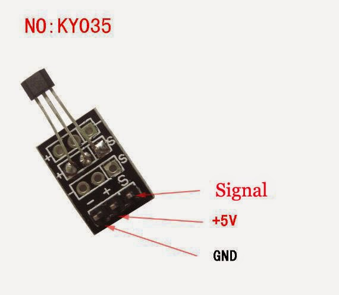
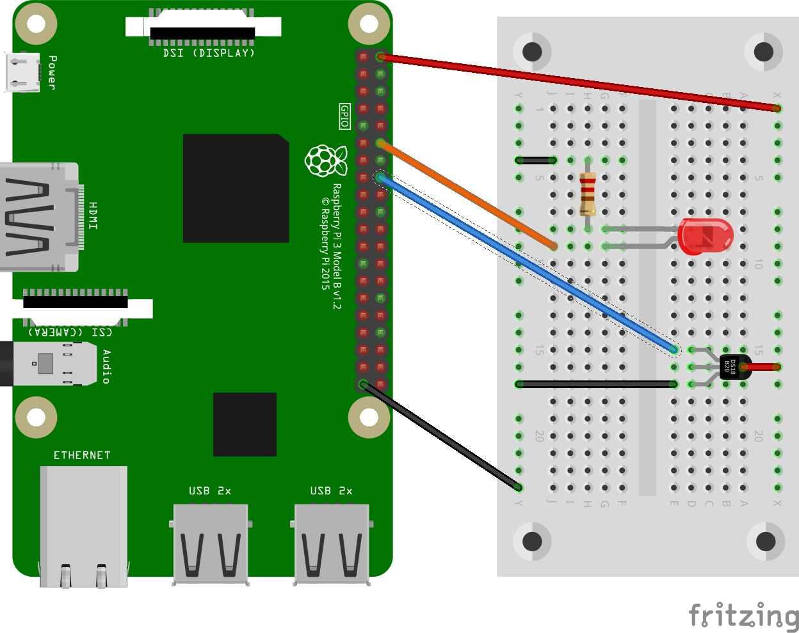

# Sensor d'efecte Hall

Els sensors d'efecte Hall poden detectar la presència de camps magnètics, per tant es poden fer servir juntament amb un imant per a detectar moviments o rotacions.

En la figura de sota es pot veure el mòdul d'efecte Hall que farem servir. Es pot apreciar a què correspon cada pota del sensor. Habitualment la pota corresponent a la senyal té una S gravada, la pota corresponent a GND té un signe - i, a vegades la pota d'alimentació (Vcc) té un signe +.




En aquest cas utilitzarem un imant per a provar el sensor. Una vista de com fer el connexionat es pot veure a la figura inferior.



En el circuit tenim el sensor Hall connectat al pin 16 i un LED al pin 12 de la Raspberry. Provarem el sensor Hall fent un programa que, quan detecti un camp magnètic (quan apropem un imant), encengui el LED.

A sota podem veure el codi Python corresponent.


```python
import RPi.GPIO as GPIO

#Hall sensor is connected to pin 16 (BOARD-Layout!)
HALL = 16 

#LED is connected to pin 12 (BOARD-Layout!)
LED  = 12

#Set pin-layout to BOARD
GPIO.setmode(GPIO.BOARD)

#Avoid error messages if GPIO was not shut down correctly before
GPIO.setwarnings(False) 

#Set HALL-pin to input, use internal pull-up-resistor
GPIO.setup(HALL,GPIO.IN, pull_up_down=GPIO.PUD_UP) 

#Set LED-pin to output. A resistor should be used here!
GPIO.setup(LED, GPIO.OUT)

#Turn LED off
GPIO.output(LED, GPIO.LOW)

#This function will be called if a change is detected
def change_detected(channel):
    if GPIO.input(HALL) == GPIO.LOW:
        print('Magnetic material detected: LED on')
        GPIO.output(LED, GPIO.HIGH) #LED on
    else:
        print('No magnetic material: LED off')
        GPIO.output(LED, GPIO.LOW) # LED off

# Register event-listener on falling and raising
# edge on HALL-sensor input. Call "change_detected" as
# callback
GPIO.add_event_detect(HALL, GPIO.BOTH, change_detected, bouncetime=25)

# The main-loop does nothing. All is done by the event-listener
try:
    while True:
        pass

# Quit on Ctrl-c
except KeyboardInterrupt:
    print("Ctrl-C - quit")

# Cleanup GPIO
finally:
    GPIO.cleanup() 
```

## Discusió:
Podem apreciar que el bucle principal no fa res, tota la feina la fa la línia de codi que es dedica a detectar esdeveniments. En aquest cas, si canvia l'estat del pin `HALL` es llança la funció `change_detected` que, en funció del canvi detectat fa que el LED s'encengui o s'apagui. El paràmetre `bouncetime` correspon a un número donat en mil·lisegons que és el temps que s'esperarà abans de fer una nova mesura. Això es fa per a evitar els canvis ràpids del valor del voltatge degut a transitoris interns del dispositiu de mesura coneguts com a "rebots". Si observem un comportament una mica erratic del sensor podem probar d'augmentar aquest valor.
