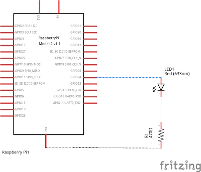

# Encendre un led amb Raspberry Pi

En aquest exercici utilitzarem els pins GPIO de la RPi per a controlar un LED.
Necessitarem el següent material:

* 1 LED
* 1 resistència de 470 ohm
* 1 Protoboard
* Cables
* Placa Raspberry Pi, teclat, pantalla i ratolí.

En la figura de sota es pot observar l'esquema del circuit. El LED  està connectat el pin 18 de la RPi (no confondre amb la numeració BCM que correspon al GPIO24). En sèrie amb el LED hi ha una resistència de 470 ohm. La raó d'aquesta resistència és protegir el LED. Per saber com es calcula el valor de la resistència de protecció feu clic aquí. El circuit es tanca amb la resistència connectada a terra (GND).



En la figura inferior es mostra la representació física del circuit. Una cosa a tenir en compte és que els LED tenen polaritat, es a dir, no és igual connectar-los d'una manera que d'altra. Hem de connectar l'ànode al potencial (voltatge) més alt, en cas contrari el LED no s'encendrà. Per a més informació sobre com funciona un LED feu clic aquí.


Per a encendre i apagar el LED farem servir el programa que apareix a sota on utilitzem la biblioteca RPi.GPIO per a controlar els pins.

## Controlar el led

Per a encendre el led farem un programa en llenguatge Python. Python conté un mòdul que permet controlar els pins anomenats GPIO (General Purpose Input/Output) de la Raspberry Pi. El mòdul es diu `RPi.GPIO` i l'hem d'importar al començament del programa per a poder treballar amb ell.

Per escriure el programa podem fer servir l'entorn de desenvolupament IDLE que ve preinstal·lat o el podem escriure en l'editor de text que porta la Raspberry Pi.

El codi del programa serà:


```python
import RPi.GPIO ad GPIO

GPIO.setmode(GPIO.BOARD)
GPIO.setup(18, GPIO.OUT)

GPIO.output(18, True)
```

Per a encendre el led ferem el següent:

1. Importarem el mòdul RPi.GPIO per a poder comunicar-nos amb els pins de la Raspberry, l'importem amb l'àlies GPIO per a ser més breus.
    
2. El següent que hem de fer és dir quina manera farem servir per a comptar els pins (n'hi ha dues maneres: amb la numeració de la placa BOARD i amb la numeració del xip BCM), nosaltres sempre farem servir la numeració BOARD perquè és més fàcil.

3. Definirem quin pin farem servir i si el farem servir com entrada o com sortida amb `GPIO.setup(18, GPIO.OUT)`. En el nostre cas utilitzarem el pin 18 i el definim com sortida.
4. Per últim donarem l'ordre d'encendre el led això es fa amb `GPIO.output(18, True)`. On `True` indica que la sortida està encesa, si volem apagar-la hem de posar `False`. També podem posar 1 o `HIGH` en comptes de `True` i 0 o `LOW` en comptes de `False`.

Per a provar el nostre codi el podem executar des de l'IDLE o, un cop guardat el fitxer, obrim un terminal fent clic a l'icona del terminal a la barra de tasques i lexecutem des del terminal escrivint:

`python <nom del fitxer>`

## Fer que el led faci pampallugues

Si volem que el led s'encengui i apagui alternativament hem d'importar el mòdul `time` per gestionar el temps. Per fer que el led s'ensengui i s'apagui en intervals de 1 segon podem escriure el següent codi:


```python
import RPi.GPIO as GPIO
import time

GPIO.setmode(GPIO.BOARD)
GPIO.setup(18, GPIO.OUT)

for val in range(10):
    GPIO.output(18, True)
    time.sleep(1)
    GPIO.output(18, False)
    time.sleep(1)
    
```

En aquest cas tenim que el led s'encèn i s'apaga 10 vegades (bucle `for`) romanent 1 segon encès i 1 segon apagat en cada cicle.

## Millorant el codi

El codi anterior és completament funcional però podem plantejar el següent codi com una millora, afegint-hi comentaris i separant la part de configuració (funció `setup`, que s'executa només una vegada) i el bucle principal (`main`). A continuació podem observar el llistat del codi:


```python
#!/usr/bin/python
#LEDtest.py

import time
import RPi.GPIO as GPIO

# LED Blink
#HARDWARE SETUP
# P1
# 2[======X=L===========]40
# 1[====================]39
# X=GND (14) L=LED (18)

LED_ON = 1
LED_OFF = 0

#LED CONFIG - Set GPIO Ports
LED = 18

# Funció que defineix les característiques dels pins
def led_setup():
    #Setup the wiring
    GPIO.setmode(GPIO.BOARD)   #Mode BOARD de comptar els pins
    #Setup Port
    GPIO.setup(LED,GPIO.OUT)   #El PIN 18 es defineix com sortida

def main():
    led_setup()
    for val in range(10):
        GPIO.output(LED,LED_ON)   #S'encén el LED
        print("LED ON")
        time.sleep(5)             #Esperem 5 segons
        GPIO.output(LED,LED_OFF)  # Apaguem el LED
        print("LED OFF")
        time.sleep(5)             #Esperem 5 segons
try:
    main()
finally:
    GPIO.cleanup()
    print("Tot tancat. FI")
#End
```
