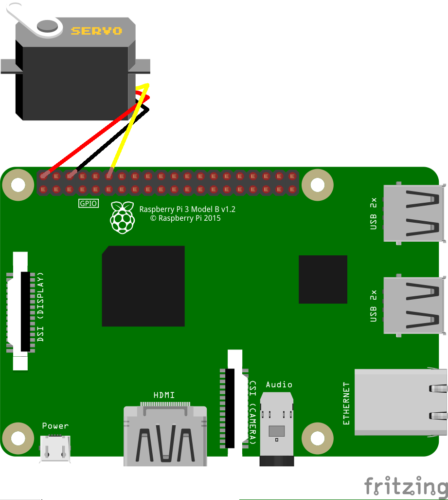
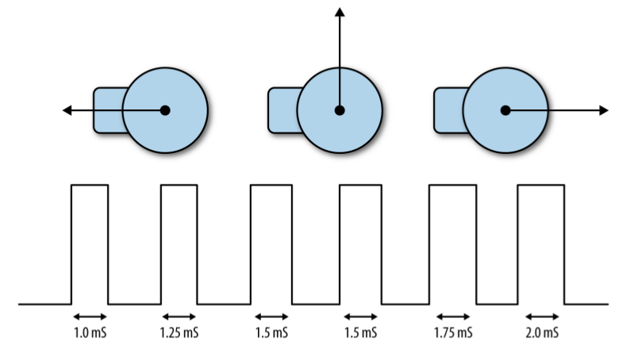
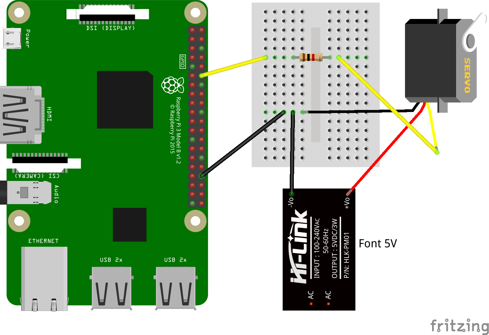

# Controlar un servo motor

Els servo motors són motors que s'utilitzen per a fer girs de menys d'una volta, no són motors de girs continus. A la figura inferior podem veure un motor servo, podem veure que té 3 cables. El cable vermell s'ha de connectar a l'alimentació (5 V), el marró és la conexió a terra (Gnd) i el taronja s'ha de connectar al pin que controlarà quant ha de girar el motor.


Com ja sabeu, la Raspberry Pi no conté sortides analògiques, només digitals. Per fer funcionar el servo haurem de simular la sortida analògica fent servir la tècnica coneguda com PWM (pulse-width modulation) que ja hem provat abans quan vam controlar la [brillantor d'un LED](https://niobio.github.io/raspi/led/brillantor_led.html). En aquest cas començarem per provar amb un programa molt semblant al que vam fer servir pel LED, podem veure la connexió del motor a la figura de sota



El codi corresponent es pot veure a continuació.


```python
import RPi.GPIO as GPIO
import time

motor_pin = 12

GPIO.setmode(GPIO.BOARD)
GPIO.setup(motor_pin,GPIO.OUT)

pwm = GPIO.PWM(motor_pin,100)
pwm.start(5)

try:
    while True:
        duty = int(input("Entrar gir (0 a 20): "))
        pwm.ChangeDutyCycle(duty)
        
finally:
    print("Cleaning up")
    GPIO.cleanup()
```

Els motors servo s'utilitzen en vehicles de control remot o robots. Molts servos no son continus, es a dir, no poden rotar tota una volta sinó que ho fan fins un angle màxim de 180 graus. La posició del servo està fixat per la longitud del pols. El motor servo espera rebre un pols al menys cada 20 mil·lisegons. Si el pols està a `HIGH` per 1 ms el motor es posarà a un angle de zero graus, si és de 1,5 ms l'angle serà de 90 graus (posició central) i, si és de 2 ms, es posarà a 180 graus (veure figura inferior).



En el codi es pot veure que la funció GPIO.PWM crea en el pin `motor_pin`, corresponent al pin 12, que fixa la freqüencia del pols en 100 Hz, es a dir, que emet un pols cada 10 ms. Per a que el motor giri 180 graus ha de tenir un pols d'amplada 2 ms, això vol dir un 20% del període. Per això fem que el valor de l'angle es pugui variar posant valors entre 0 i 20 que correspondrà a valors entre 0 i 180 graus.

També podem connectar el servo a una font d'alimentació externa tal com podem veure a la figura següent.



També podem utilitzar una interfície gràfica per a controlar el gir del motor. Python porta una biblioteca gràfica, Tkinter, que permet crear finestres o objectes gràfics. Utilitzarem aquesta biblioteca per a crear un control lliscant per a variar l'angle de gir del motor. A sota podem veure l'aspecte del control:


A diferència del codi anterior, on el gir el controlàvem amb valor des de 0 fins a 20, en aquest codi el valor a variar és directament l'angle, prenent valors entre 0 i 180 graus. Dintre del codi es fa la transformació per a que el valor de l'angle es converteixi en els valor del cicle de treball (de 0 a 20 aprox). Podem fer proves variant els valors lleugerament per a que els angles s'ajustin als valors desitjats.


```python
from tkinter import *
import RPi.GPIO as GPIO

GPIO.setmode(GPIO.BCM)
GPIO.setup(18, GPIO.OUT)
pwm = GPIO.PWM(18, 100)
pwm.start(5)

class App:
    def __init__(self, master):
        frame = Frame(master)
        frame.pack()
        scale = Scale(frame, from_=0, to=180, orient=HORIZONTAL, command=self.update)
        scale.grid(row=0)

    def update(self, angle):
        duty = float(angle) / 10.0 + 2.5
        pwm.ChangeDutyCycle(duty)

try:
    root = Tk()
    root.wm_title('Servo Control')
    app = App(root)
    root.geometry("200x50+0+0")
    root.mainloop()
finally:
    GPIO.cleanup()
```
