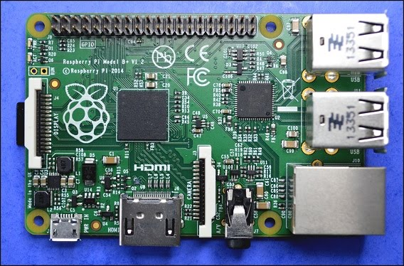
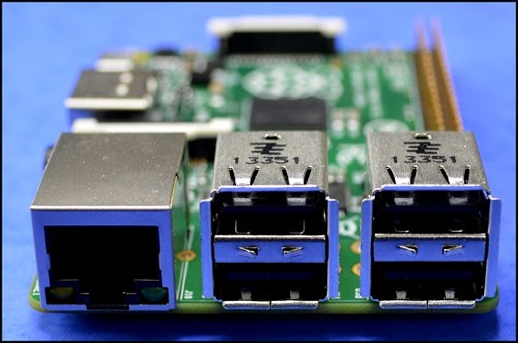
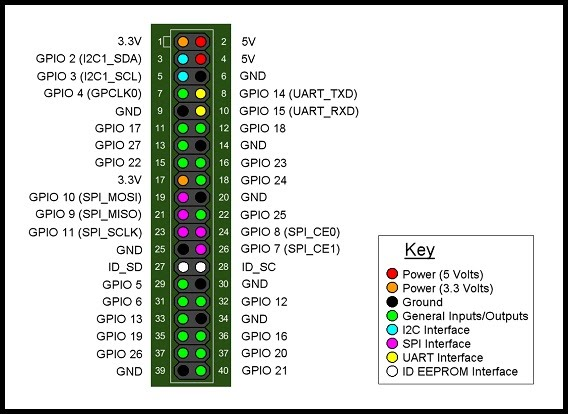

# Introducció a Raspberry Pi

Raspberry Pi és un ordinador de la mida d'una targeta de crèdit. Per a tenir un ordinador complet només necessitem connectar a la Raspberry un monitor, un teclat i un ratolí. Per alimentar la placa fem fervir un carregador de mòbil. A sota podem veure una imatge de la placa Raspberry Pi 2 model B, l'última versió, en la seva mida real.

La Raspberry Pi, en lloc de disc dur, fa servir una targeta de memòria microSD (les que fan servir alguns telèfons mòbils). Per a connectar la pantalla té un port de vídeo HDMI on tenim vídeo d'alta definició (HD). La placa conté 4 ports USB, connexió a internet a través d'un port Ethernet, sortida d'audio i, potser el més interessant, una serie de connectors (40 pins) anomenats GPIO (General Purpose Input/Output) que serveixen per a connectar amb una inabastable quantitat de dispositius diferents com ser sensors o actuadors. Justament són aquest connectors els que aprofitarem per a fer els nostres projectes d'internet de les coses (IoT, Internet of Things).

La RPi té 4 ports USB i un port Ethernet per a connectar a internet.

Els terminals de 40 pins de la RPi es poden utilitzar per a alimentar altres dispositius amb 3,3 V o 5 V o per a comunicar informació amb altres dispositius, rebent informació (dels sensors) o enviant informació (als actuadors). A la figura inferior es pot observar la dedicació dels pins GPIO. Alguns dels pins s'utilitzen per a comunicar-se amb determinats protocols de comunicació (I2C, UART, SPI).

La RPi es pot utilitzar per alimentar dispositius utilitzant els pins 2 i 4 per a obtenir 5V de sortida (el corrent màxim és el que pot subministrar la connexió USB, 750 mA). La placa també conté dos pins (1 i 17) que poden subministrar 3,3 V amb un corrent màxim de 50 mA. Els pins marcats com GND (Ground) indiquen la connexió a terra (0V).

En Python utilitzarem el mòdul RPi.GPIO per a controlar els pins. Hi ha dues maneres de anomenar els pins, una és utilitzant la numeració de la placa (números blancs a la figura), que es diu mode GPIO.BOARD i l'altra, utilitzant els números de ports del processador (números externs) que es diu mode GPIO.BCM. Nosaltres utilitzarem sempre el mode BOARD.
