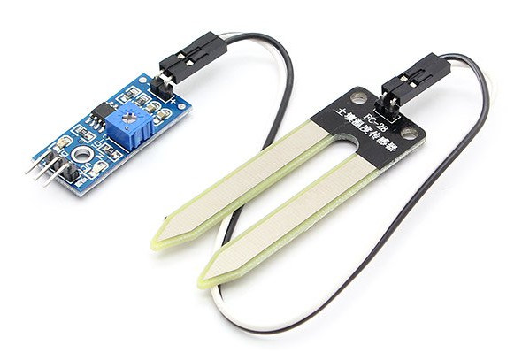

# Sistema automatic de reg amb Raspberry Pi

En aquest projecte dissenyarem un sistema de reg automàtic per a un hort o un parc. El sistema s'ha d'activar només quan les plantes necessiten aigua. En el nostre projecte utilitzarem una placa Raspberry Pi per a activar una vàlvula que roman tancada fins que la placa decideix obrir-la per regar les plantes, la Raspberry Pi decidirà quan activar la vàlvula depenent dels valors d'humitat del sòl. Per a mesurar el grau d'humitat farem servir un sensor d'humitat model FC-28.

## El sensor d'humitat

El sensor que farem servir serà el model FC-28. La manera que té aquest sensor de mesurar el nivell d'humitat és a través del seu voltatge de sortida, quant més humitat hi ha més alt és el voltatge de sortida i, a l'inrevés, si el nivell d'humitat és baix el voltatge de sortida serà baix. 

El sensor FC-28 porta incorporat un potenciòmetre que permet ajustar la sensibilitat a la humitat, per tant, serveix com una manera de calibrar quin serà el valor de voltatge que tindrà la sortida en relació a la quantitat d'humitat a la que està exposat.

En el nostre projecte connectarem el FC-28 a la Raspberry Pi de manera que podrem llegir la quantitat de tensió de sortida del sensor i que ens pugui dir si el valor d'humitat detectada està per sota de determinat valor llindar. D'aquesta manera sabrem que les plantes necessiten reg.



## Components bàsics per a la construcció del prototip

* Sensor d'humitat FC-28.
* Placa Raspberry Pi.
* Placa de prototipatge ràpid (protoboard) i cables.
* Condensador de $10\,\mathrm{\mu F}$
* 2 resistències de $1\,\mathrm{k\Omega}$
* 1 resistència de $220\,\Omega$
* 1 relé 
* 1 vàlvula de 12V DC
* 1 adaptador de 12V per alimentar la vàlvula.

El sensor d'humitat té quatre pins: AO, DO, VCC i GND. El pin VCC correspon a l'alimentació, la qual ha d'estar entre 3,3 V i 5 V per a que pugui ser operatiu, el pin GND correspon a la connexió a terra, per tant, per alimentar el sensor hem d'aplicar entre 3,3 V i 5 V entre VCC i GND. El terminal AO és la sortida analògica i el terminal DO és la sortida digital. Nosaltres farem servir la sortida analògica, ja que ens permetrà un millor calibratge del sensor.

## Esquema del circuit sensor

La figura inferior ens mostra el circuit esquematic que muntarem pel nostre sensor.


Per alimentar el sensor d'humitat connectarem el pin VCC del FC-28 al terminal de 5 V de la RPi (pin 2) i el terminal GND del sensor al terminal GND de la RPi (pin 34). La sortida del sensor (pin AO) va connectat a una resistència i un condensador que serviran de conversor A/D.

L'actuador del circuit és una vàlvula que funciona amb una alimentació de 12 V de corrent contínua. Per a controlar la vàlvula farem servir un relé connectat al pin 12 de la Raspberry.

A continuació es pot veure el codi Python per fer funcionar el sistema de reg.


```python
import RPi.GPIO as GPIO
import time

GPIO.setmode(GPIO.BOARD)

# El pin a carrega el condensador a través d'una resistència fixa d'1k 
# i el potenciómetre en sèrie.
# El pin b descarrega el condensador a través de la resistència d'1k

pin_a = 16
pin_b = 18
pinout = 12

GPIO.setup(pinout, GPIO.OUT)

# Funció per la descàrrega del condensador, deixant-lo buit per a començar la càrrega
def descarrega():
    GPIO.setup(pin_a, GPIO.IN)
    GPIO.setup(pin_b, GPIO.OUT)
    GPIO.output(pin_b, False)
    time.sleep(0.1)

# Funció que retorna el temps de càrrega del condensador en microsegons fins arribar
# al nivell HIGH, el qual és major o igual a 1.65V.
def temps_carrega():
    GPIO.setup(pin_b, GPIO.IN)
    GPIO.setup(pin_a, GPIO.OUT)
    GPIO.output(pin_a, True)
    t1 = time.time()
    while not GPIO.input(pin_b):
        pass
    t2 = time.time()
    return (t2 - t1) * 1000000

# Funció que pren el temps de càrrega del condensador com a lectura analògica
# després de primer descarregar el condensador
def lectura_analog():
    descarrega()
    t = temps_carrega()
    descarrega()
    return t

try:
    while True:
        t = lectura_analog()
        print(t)
        if t < 70:
            GPIO.output(pinout, True)
        else:
            GPIO.output(pinout, False)
        time.sleep(5)
finally:
    GPIO.cleanup()
```

El programa fa la lectura del temps de càrrega del condensador cada 5 segons i l'imprimeix a la pantalla del terminal. Si la lectura és inferior a 70 el pin de sortida es posa en `True` i s'obre la vàlvula per a que passi l'aigua.
