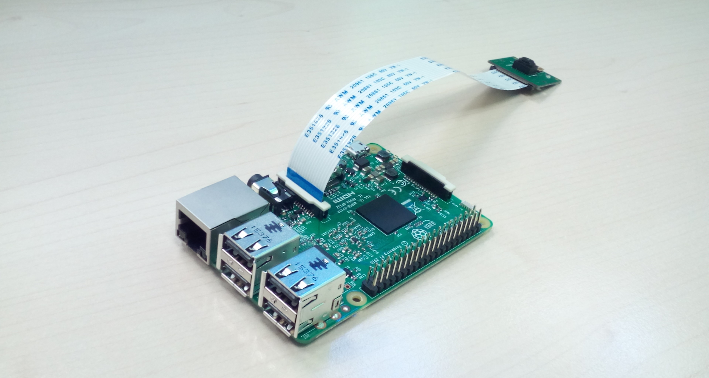
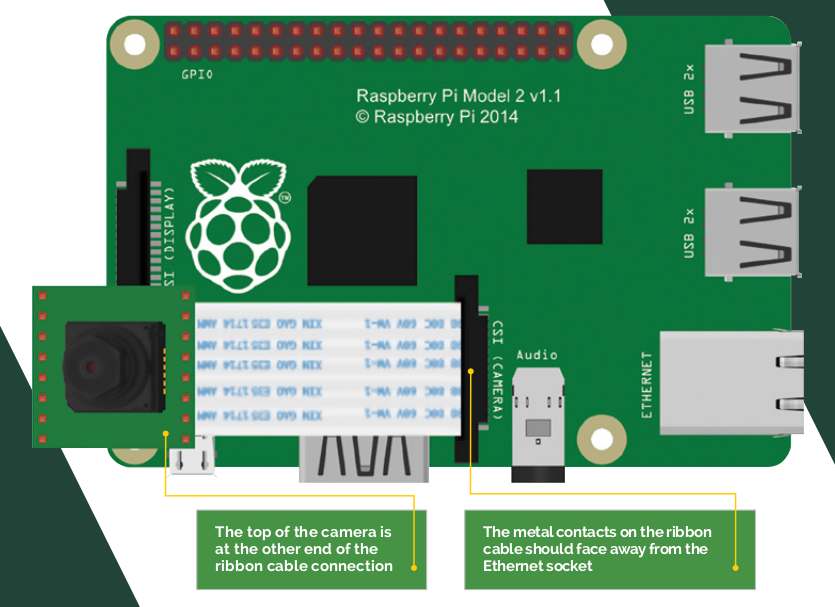

# Controlar la càmera amb Raspberry Pi


Hi ha una càmera especialment dissenyada per acoplar-la a la Raspberry Pi, és la Raspicam. 



## Connectar la càmera

Per aconnectar la càmera hem de tirar cap amunt el lliscador de plàstic del sòcol indicat amb el rètol `CAMERA`. La cinta de cables ha de posar-se de manera que la part blava estigui mirant cap el port Ethernet com es veu a la figura de sota.



## Provant la càmera

Per a provar la càmera podem prendre les primeres imatges executant la següent ordre des del terminal:

`raspistill -o primerafoto.jpg`

## Mirar la imatge

Per veure la imatge podem posar:

`gpicview primerafoto.jpg `

Aquests programes tenen moltes més opcions, per veure-les consulteu la referència que podeu trobar al final d'aquesta pàgina.

## Controlar la càmera amb Python

Per a controlar la càmera amb Python és necessari fer servir el mòdul de Python `picamera`. Per a instal·lar el mòdul, des del terminal executem:

`sudo apt-get install python3-picamera`

Per a poder instal·lar aquest mòdul hem de tenir la Raspberry Pi connectada a internet.


## Controlar la càmera amb un botó

A sota podem veure el codi per a controlar la càmera amb un botó.


```python
#importació de mòduls
from datetime import datetime
import RPi.GPIO as GPIO
import picamera

GPIO.setmode(GPIO.BOARD)

pin_boto = 14

GPIO.setup(pin_boto, GPIO.IN, pull_up_down=GPIO.PUD_DOWN)
pc = picamera.PiCamera()

running = True
#pc.resolution = (1024, 768)
#use this to set the resolution if you dislike the default values

timestamp=datetime.now()

def picture():
    pc.capture('pic'+str(timestamp)+'.jpg') #taking the picture
    
GPIO.add_event_detect(pin_boto, GPIO.RAISING, callback=picture, bouncetime=500)    

try:
    print("Activa")
    while running:
        pass

#we detect Ctrl+C then quit the program
except KeyboardInterrupt:
    running = False
    GPIO.cleanup()
```

## Controlar una càmera web amb Python
 
Per a controlar una càmera web amb Raspberry Pi podem fer servir l'aplicació `fswebcam`. Per instal·lar aquesta aplicació primer hem d'intsl·lar-la amb l'ordre següent en el terminal:

`sudo apt-get install fswebcam`

Per a prendra una imatge podem utilitzar la següent ordre al terminal:

`fswebcam image.jpg`

si volem espacificarr la resolució fem:

`fswebcam -r 1280x720 image2.jpg`

Si volem fer servir la càmera en un script de Python podem fer servir el paquet `os` per a accedir a les ordres del sistema. Un exemple d'ús pot ser el codi següent, on la càmera pren una imatge cada 15 segons:


```python
import time 
import os 

while True: # bucle infinit
    os.system('fswebcam -r 320x240 -S 3 --jpeg 50 --save /home/pi/imatges/%H%M%S.jpg') # uses Fswebcam to take picture
time.sleep(15) # this line creates a 15 second delay before repeating the loop
```

## Referència:

Per a més informació sobre com controlar la càmera amb la Raspberry Pi veure:

[https://www.raspberrypi.org/magpi-issues/Essentials_Camera_v1.pdf](https://www.raspberrypi.org/magpi-issues/Essentials_Camera_v1.pdf)
