# Introducció a l'electrònica i els seus components

## Les magnituds elèctriques i la seva medició

Per al mesurament de les magnituds elèctriques utilitzarem un instrument de funcions múltiples anomenat **polímetre**, **multímetre** o **tester**. Aquest és un instrument molt pràctic, ja que permet mesurar
Para la medición de las magnitudes eléctricas utilizaremos un instrumento de funciones múltiples llamado polímetro, multímetro o tester. Este instrumento es muy práctico, ya que permite medir varias magnitudes eléctricas según como se conecte.

### Tensió o voltatge
La **tensió** o **voltatge** (V), és l'energia per unitat de càrrega que fa que les càrregues (electrons) es moguin pel circuit. En el Sistema Internacional d'unitats (SI) s'expresa en volts (V). Un altre nom utilitzat per aquest magnitud és **Diferència de potencial**.
Per a mesurar la tensió sobre un component s'ha de connectar el polímetre en paral·lel amb el component i i l'instrument ha d'estar en la seva posició de voltímetre.

<figure>
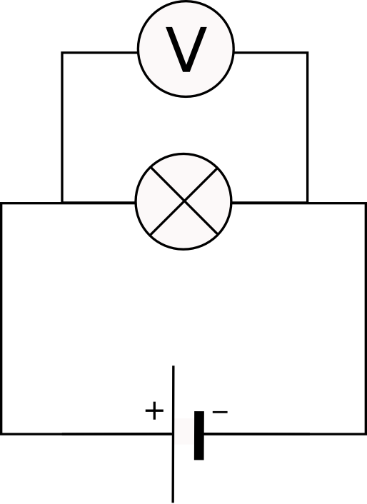
</figure>

### Intensitat de corrent
La intensitat de corrent, I, és la quantitat de càrrega que circula per un conductor per segon. La unitat d'intensitat en el SI és l'**amper** o **ampere** (A). Per a mesurar la intensitat s'ha de connectar el polímetre en sèrie i l'instrument ha d'estar en la seva posició d'amperímetre. 
  
<figure>
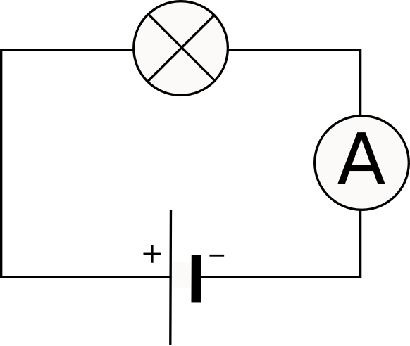
</figure>

### Resistència
La resistència, R, és el grau d'oposició que presenten els conductors al pas del corrent elèctric. En el SI s'expressa en **ohms** ($\Omega$). Per a mesurar la resistència amb el polímetre, el component per al qual volem mesurar la seva resistència ha d'estar deconnectat del circuit per tal de fer la mesura, es a dir, no ha de tenir tensió aplicada. El selector de l'intrument ha d'estar en la seva posició d'ohmímetre.
  
<figure>
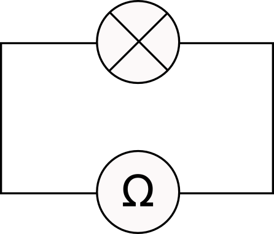
</figure>

### El polímetre

  
<figure>
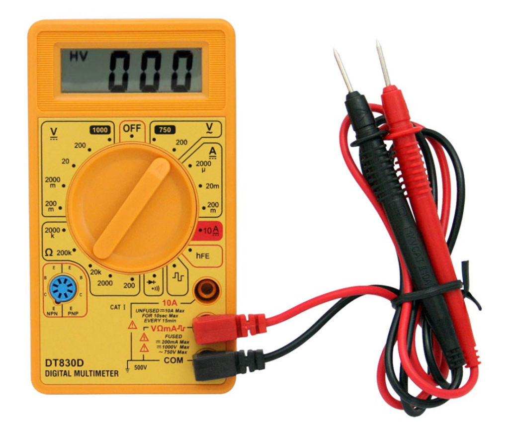
</figure>

## Llei d'Ohm
La llei d'Ohm estableix que les tres magnitud esmentades no són pas independents entre sí, sinó que es relacionen a través de l'expresió matemàtica

$$V=I\times R$$

On $V$ s'expressa en voltes (V), $I$ s'expressa en ampers (A) i $R$ s'expressa en ohms ($\Omega$). D'aquesta manera, donada dues de les magnituds es pot determinar la tercera fent servir la relació anterior i aïllant la magnitud incògnita.

## Potència
La potència ($P$) és l'energia per unitat de temps que consumeix un receptor o que produeix un generador. Es pot calcular a partir de la tensió i de la intensitat de corrent: 

$$P=V\times I$$

En el SI la potència s'expressa en **watts** (W). De manera que 1 watt = 1 volt $\times$ 1 amper. Altra manera habitual d'expressar la potència és a través del múltiple del watt: el kilowatt (kW).

$$1\mathrm{kW}=1000\,\mathrm{W}=10^{3}\mathrm{W}$$

També es pot expressar en milions de watts a través del megawatt (MW).

$$1\mathrm{MW}=1\,000\,000\mathrm{W}=10^{6}\mathrm{W}$$

## Connexió de components elèctrics
### Circuito en sèrie

En la figura de sota podem veure tres bombetes connectades en sèrie (una a continuació de l'altra). 

<figure>
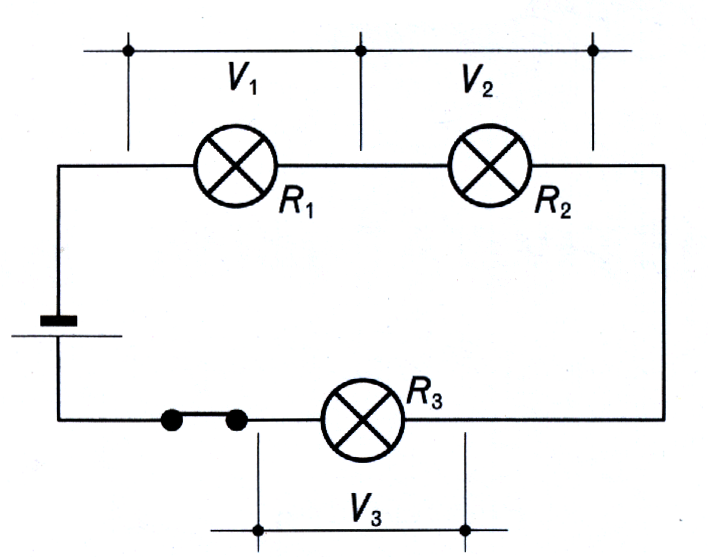
<figcaption>Circuit sèrie.</figcaption>
</figure>

En un circuit com aquest les magnituds elèctriques que hem vist abans es comporten de la següent manera:

* **Intensitat**: en un circuit sèrie la intensitat de corrent que passa per tots els componente és la mateixa. És clar que si el corrent està formada pels electrons que hi circulen i només té un camí, resulta lògic que en tots els components passi la mateixa intensitat de corrent

$$I=\textrm{constant}$$

* **Tensió**: L'energia amb la que hi circulen els electrons es va perdent en cada receptor del circuit, per tant, el voltatge es reparteix entre els receptors. De manera que es verifica que:

$$V=V_1+V_2+V_3$$

Aquesta llei es coneix com 2a llei de Kirchoff.

* **Resistència equivalent del circuit**: Les resistències d'un circuit es poden reemplaçar per una d'equivalent, elvalor de la qual es pot calcular com

$$R=R_1+R_2+R_3$$

## Circuit paral·lel

La connexió de bombetes en paral·lel es fa tal com es mostra a la figura següent.

<figure>
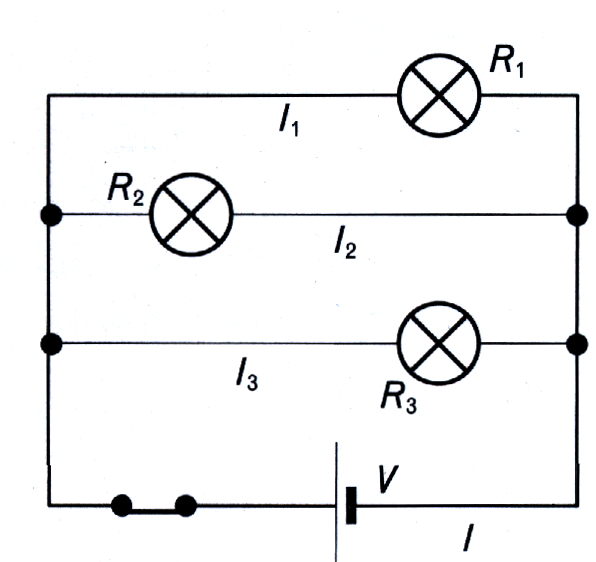
<figcaption>Circuit paral·lel.</figcaption>
</figure>

* **Tensió**:Al contrari del que passa amb el circuit sèrie, en el circuit paral·lel el que roman constant per e tots els receptors és el voltatge.

$$V=\textrm{constant}$$

* **Intensitat**: depèn del valor de la resistència que han de travessar els electrons. Quan més petita sigui la resistència, la intensitat serà més altal La intensitat produïda pel generador serà la suma de les intensitats en cada branca del circuit.  

$$I=I_1+I_2+I_3$$

* **Resistència equivalent del circuit**: La resistència equivalent del circuit es calcula com

$$R=\frac{1}{\frac{1}{R_1}+\frac{1}{R_2}+\frac{1}{R_3}}$$

## Elements de control

Per a controlar els circuit elèctrics s'utilizen elements de maniobra o control. Podem enumerar els següents:
* Interruptors
* Polsadors
* Commutadors
* Relés

### Interruptors
Obren i tanquen el circuit i mantenen la mateixa posició fins que tornem a intervenir modificant la seva posició.

<figure>
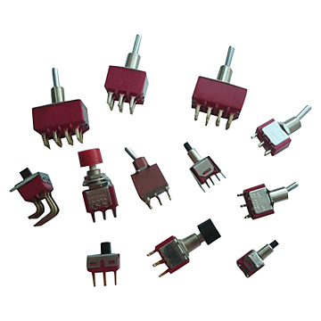
<figcaption>Interruptores de diferentes tipos y el símbolo del interruptor.</figcaption>
</figure>

### Polsadors
Obren i tanquen el circuit, però, a diferència dels interruptors, tornen a la seva posició original en quant deixem de prémer:

Els polsadors del tipus NORMAL OBERT (NO) mantenen el circuit obert fins que premem el botó i aleshores tanca el circuit que continuarà tancat mentre nosaltres polsem i s'obrirà quan deixem de premer el botó. És el cas del timbre.

Els polsadors del tipus NORMAL TANCAT (NT) mantenen el circuit tancat fins que nosaltres premen el botó per a obrir el circuit. Pot ser el cas d'un polsador d'emergència d'una escala mecànica.

Un tipus particular de polsadors són els anomenats **final de carrera**, que s'accionen mitjançant una palanca. Els finals de carrera poden actuar com NO o com NT segons com se'ls connecti. El contacte indicat com COM es fa servir sempre i l'altre serà el NO o el NT segons la funció que volem que faci.

<figure>
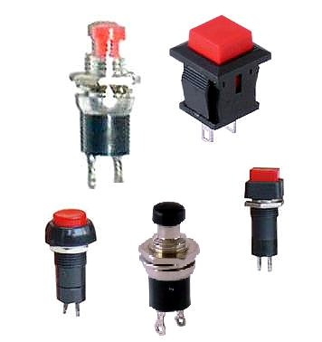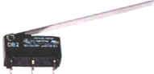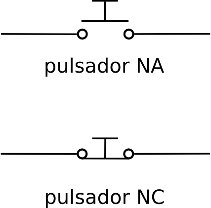
<figcaption>Polsadors de diferents tipus, polsador final de carrera i símbols dels polsadors.</figcaption>
</figure>

### Commutadors
Són elements que canvien la direcció del corrent oferint diferents camins pel corrent dintre d'un circuit. Hi ha de diferents tipus depenent de les necessitats: de planca, lliscant o rotatoris.

<figure>
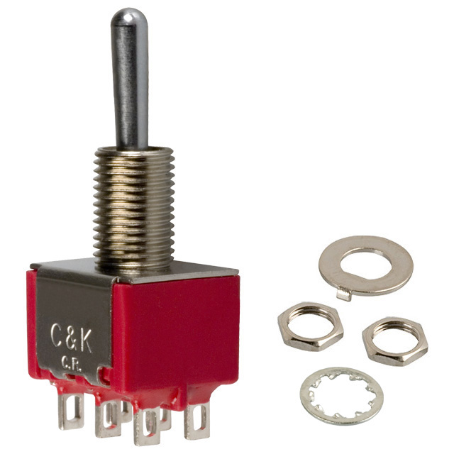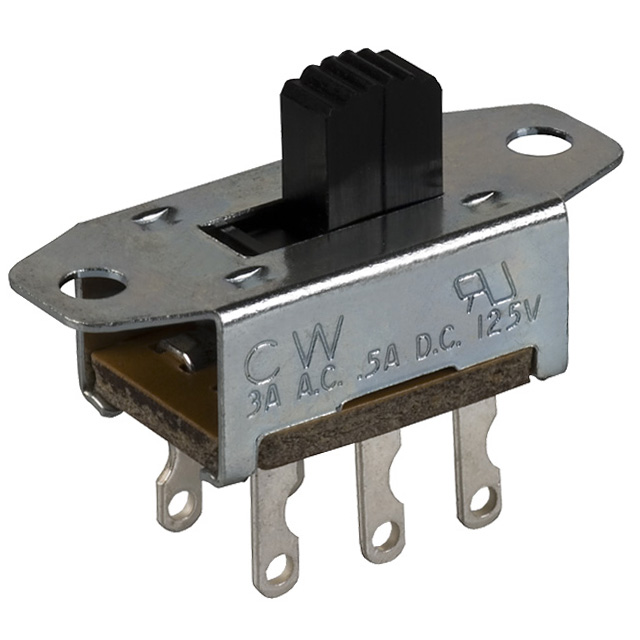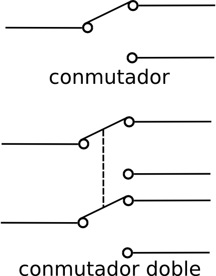
<figcaption>Commutadors i els seus símbols.</figcaption>
</figure>

### Relé
El relé es pot fer servir com commutador o com interruptor i, en lloc de ser accionat per una persona s'acciona mitjançant un corrent elèctric. Té dos parts ben diferenciades. Una bobina amb un nucli que actua com electroimant i un mecanisme amb tres contactes.

<figure>
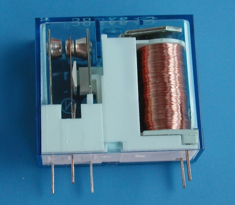
<figcaption>Fotografia d'un relé. Es pot observar a l'esquerra els 3 contactes que funcionen com commutador simple i, a la dreta, els dos contactes de l'electroimant.</figcaption>
</figure>

#### El relé com interruptor
Al tancar l'interruptor 1, l'electroimant del relé es posa en funcionament i atreula petita placa metàl·lica 2. La palanca de la placa, en ser atreta per l'electroimant, empeny el contacte 4 i el separa de 3, amb la qual cosa s'interromp el corrent en el circuit de la bombeta i aquesta no s'encén.

<figure>
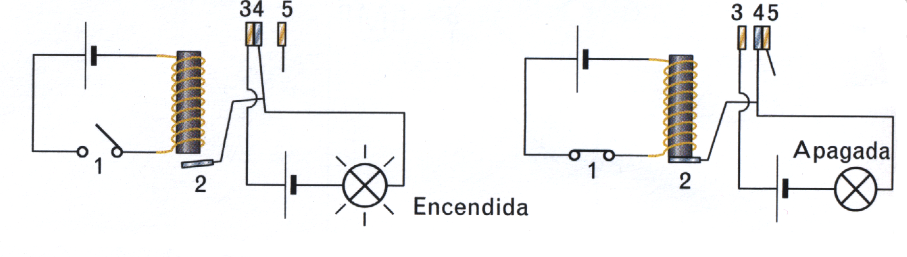
<figcaption>El relé utilitzat com interruptor.</figcaption>
</figure>

#### El relé com commutador
Al tancar l'interruptor 1, l'electroimant del relé torna a atreure la placa metàl·lica 2. La palanca de la placa, en ser atreta per l'electroimant, empeny el contacte 4 i el separa de 3, amb la qual cosa s'interromp el corrent del circuit de la bombeta. Però el contacte 4 empeny contra el 5 i això fa que es posi enfuncionament el motor.

<figure>
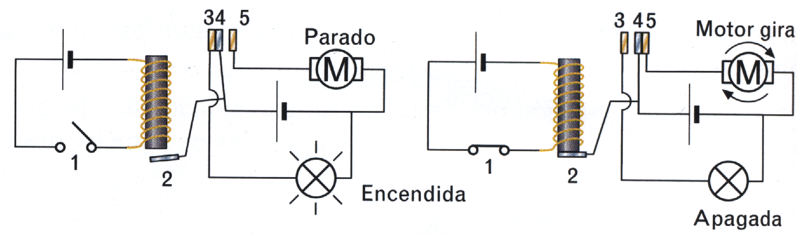
<figcaption>El relé utilitzat com commutador.</figcaption>
</figure>

## Resitències
En general es diu que ofereix resistència qualsevol cosa que s'oposi al pas de l'electricitat en un circuit. La resistència es mesura en ohms i el símbol és la lletra grega majúscula omega ($\Omega$). Les resistències electròniques són uns elements molt utilitzats en qualsevol circuit. Segons el material utilitzat en la seva construcció s'oposen més o menys al pas del corrent, o sigui, que tenen diferent valor de resistència. Aquests elements es fabriquen amb uns valors que van des d'uns pocs fins a milions d'ohms.

Les resistències amb un valor ohmic constant s'anomenen resistors o **resistències fixes**. també podem trobar resistències per a les quals el seu valor resistiu depén d'algun factor extern. A aquestes resistències les anomenarem **resistències variables**

### Resistències fixes
Les resistències fixes s'utilitzen en electrònica per:
* **Limitar** o regular la intensitat de corrent que circula pel circuit.
* **Protegir** alguns components de les altes intensitats que els podrien malmetre o destruir.

Dintre de les resistències fixes i, segons la manera de fabricar-les, diferenciem les resistències aglomerades, les de pel·lícula de carboni, les de pel·lícula metàl·lica i les bobinades. Actualment les més utilitzades són les de pel·lícula de carboni degut a la seva gran estabilitat tèrmica.

<figure>
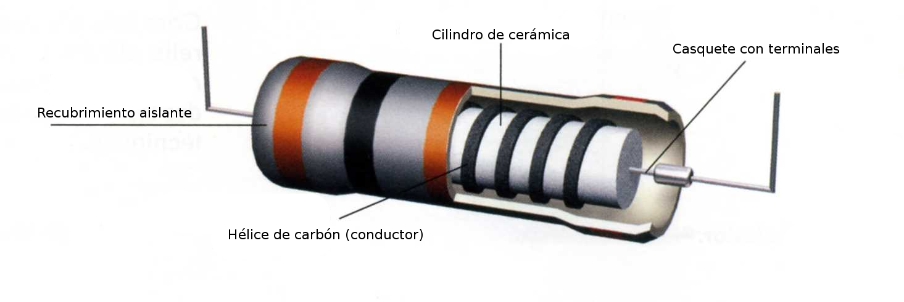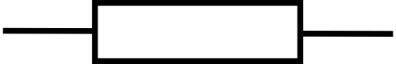
<figcaption>Esquema d'una resistència ceràmica i símbol de la resistència fixa.</figcaption>
</figure>

---
#### Exemple: La resistència com element de protecció
Si connectem una làmpara de 3V a una pilade 9V, es fon. Per a evitar-lo podem posar una resistència en sèrie amb la bombeta amb la finalitat de que es quedi amb els 6V que sobren i, d'aquesta manera, sobre la bombeta hi haurà només els 3 volts necessaris. El problema que se'ns presenta és: Quin valor hauria de tenir la resistència?

Si sabem que la intensitat que ha de circular per la bombeta és de 0,2A, com que el circuit està connectat en sèrie, la intensitat que circularà per la resistència serà també  de 0,2 A. Aplicant la llei d'Ohm podem obtenir el seu valor:

$$R=\frac{V}{I}=\frac{6\,\mathrm V}{0,2\,\mathrm{A}}=30\Omega$$

Podem comprovar amb el polímetre que el voltatge de la bombeta no superarà els 3V, desprès de posar-hi la resistència adequada.

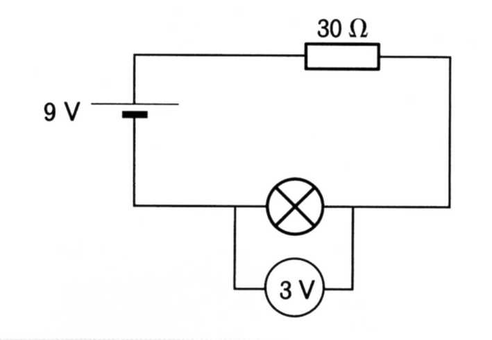

---

#### Codi de colors de les resistències

Les resistències fixes tenen un valor constant, dintre d'uns marges de tolerància. Per a identificar el valor de la resistència es fa servir un codi de colors. La major part de les resistències tenen impreses sobre la càpsula de protecció quatre bandes de colors. Les tres primeres ens dones el seu valor en ohms i la quarta la tolerància (error relatiu) d'aquest valor en percentatge.

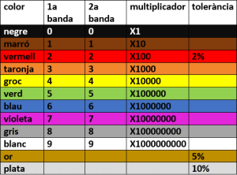

### Resistències variables
#### Potenciòmetres
Els <a href="https://ca.wikipedia.org/wiki/Potenci%C3%B2metre">potenciòmetres</a> són resistències variables que prenen valors que van des de $0\,\Omega$ i un valor màxim que acostuma venir indicat en el component. Per a canviar el valor és necessari girar un eix o deplaçar un cursor.

<figure>
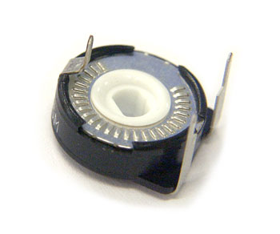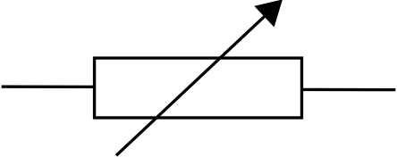
<figcaption>El potenciòmetre i el seu símbol.</figcaption>
</figure>

El potenciòmetre que es veu a la figura és un dels més utilitzats avui dia en els circuits electrònics. Entre els terminals inferiors tenim el valor total de la resistència que s'indica en el lateral del potenciòmetre i entre qualsevol dels extrems i el punt mitjà (terminal de dalt) tindrem un valor que podrm variar girant la rodeta central. Un exemple típic d'ús d'un potenciómetre és el control de volum d'un aparell de música o d'una ràdio.

#### Resistències variables amb la temperatura: NTC i PTC

Aquestes resistències canvien el seu valor quan canvia la temperatura. N'hi ha de dos tipus:

* **NTC** (Negative Temperature Coefficient): Si la temperatura augmenta, la resistència disminueix $(T\uparrow,\,R\downarrow)$.
* **PTC** (Positive Temperature Coefficient): Si la temperatura augmenta, la resistència també puja $(T\uparrow,\,R\uparrow)$.

Aquestes resistències també s'anomenen **termistors** i es fan servir en sistemes automàtics de regulació de temperatura.

<figure>
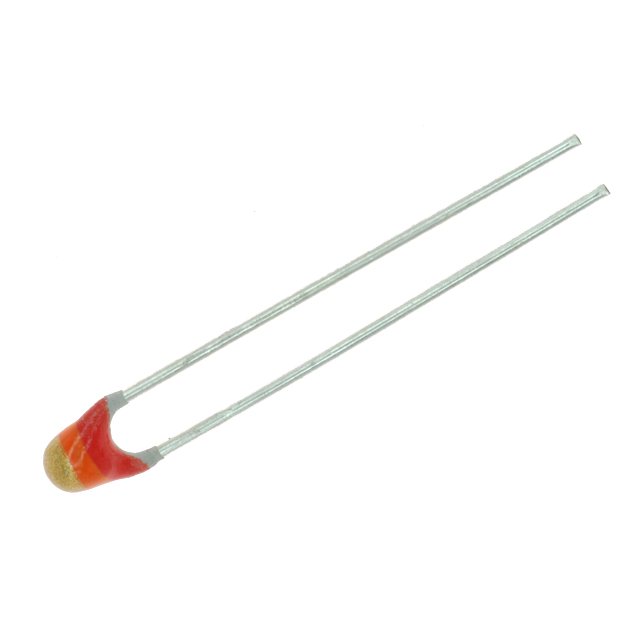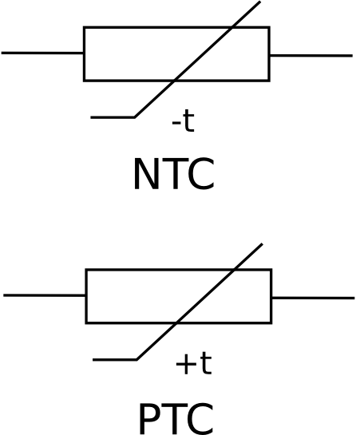
<figcaption>Termistors (resistències variables amb la temperatura). N'hi ha de dos tipus: NTC i PTC.</figcaption>
</figure>

#### Resistències variables amb la llum: Fotoresistències o LDR

Aquestes resistències, també conegudes com LDR (*Light Dependent Resistors*) es caracteritza per la disminució  del seu valor resistiu quan augmenta la intensitat de llum que l'hi arriba.
Les principals aplicacions d'aquestos components pot ser: l'automatització dels sistemes d'enllumenat (al fer-se de nit s'encenen els fanals), control de circuits amb relés, en alarmes, etc. D'aquesta manera aquestes resistències es poden considerar com sensors, la seva instal·lació al circuit és molt sencilla i no hem de mirar la polaritat per a connactar-les.

<figure>
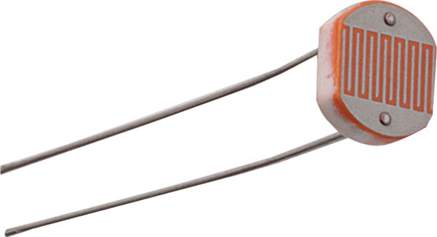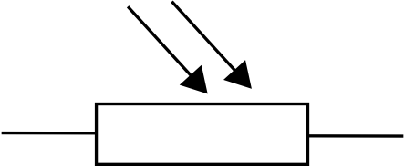
<figcaption>LDR (resistències variables amb la llum) i el seu símbol.</figcaption>
</figure>

## Capacitors
El capacitor, també anomenat condensador, és un component també bastant comú en els circuits electrònics. Un capacitor consisteix, bàsicament, en dues plaques metàl·liques separades per un material aïllant anomenat dielèctric. Aquest dielèctric acostuma ser d'aire, paper, ceràmica, mica, plàstics, etc. normalment es disposa en forma de làmina molt prima per aconseguir que les plaques, anomenades armadures, es trobin a molt curta distància.

<figure>
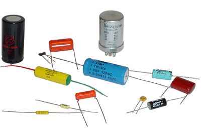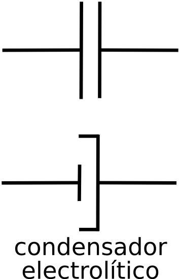
<figcaption>Capacitors. Símbol del capacitor i del capacitor electrolític. Aquest últim té polaritat.</figcaption>
</figure>

La capacitat d'un capacitor és la quantitat de càrrega que pot emmagatzemar per cada volt de tensió que s'aplica. La capacitat dels capacitors es mesura en una unitat anomenada **Farad** (F). Com aquesta unitat és massa gran per als condensadors utilitzats habitualment, es fan servir submúltiples d'aquesta unitat:

* **Microfarad**: equival a 0,000001 F i es representa $\mu F$.
* **Nanofarad**: equival a 0,000000001 F i es representa $nF$
* **Picofarad**: equival a 0,00000000001 F es representa $pF$

La capacitat (C) és la relació entre la càrrega elèctrica que emmagatzema un capacitor i el voltatge al que està sotmès.

$$C=\frac{q}{V}$$

on $C$ és la capacitat en farads (F), $q$ és la càrrega en coulombs (C) i $V$ és el voltatge en volts (V).

<figure>
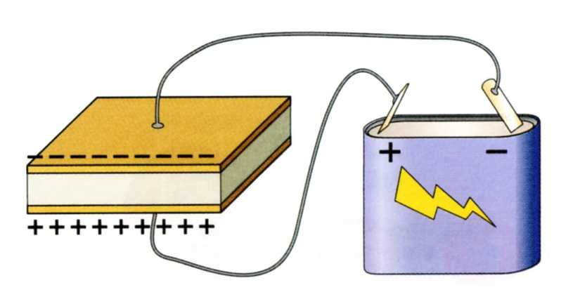
<figcaption>Les càrregues oposades s'atreuen i s'acumulen a les plaques del capacitor.</figcaption>
</figure>

Si entre els terminals d'un capacitor connectem una pila, el capacitor es carrega de manera quasi instantània. El temps que tarda es coneix com **període de càrrega**. Si una vegada carregat el capacitor, el desconnectem de la pila romandrà carregat un temps. Si ara unim els terminals del capacitor, aquest es descarregarà de manera també quasi instantània. El temps que tarda aquest procés es diu **període de descàrrega**.

Controlant el temps de càrrega i descàrrega d'un capacitor es poden construir temporitzadors. Per a controlar els períodes de càrrega i descàrrega podem connectar una resistència en sèrie amb el capacitor.

## El LED
El <a href="https://ca.wikipedia.org/wiki/D%C3%ADode_emissor_de_llum">LED</a> (*Light-Emitting Diode*) és un dispositiu electrònic amb capacitat d'emetre llum de diferents colors. Habitualment s'utilitza com pilot de senyalització (indicant si un aparell està encès o no, etc.). Aquest operador té polaritat, per tant el pol positiu de la pila s'ha de connectar al positiu del LED i el mateix amb el negatiu. Si els connectem a l'inrevés el LED no s'encendrà. Aquest element no convé connectar-lo directament al generador, ja que es pot malmetre si rep un corrent superior a la que pot suportar. Per això sempre es connecta amb una resistència de protecció en sèrie.

<figure>
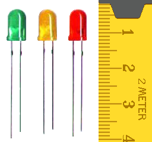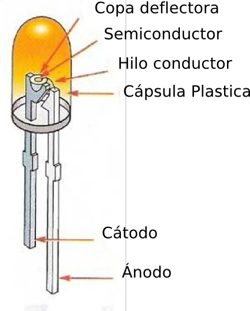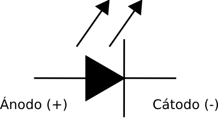
<figcaption>Diodes LED. Parts constituents i símbol.</figcaption>
</figure>

El LED no té un voltatge fixe de funcionament com pot pasar amb les bombetes de llum (suporten intensitats màximes al voltant de 80 mA i tensions de funcionament de aproximadament 1,2 V). D'aquesta manera els podem connectar a bateries o generadors amb qualsevol valor de tensió si posem una resistència de protecció adequada.

Hi ha moltes meneras de conèixer la polaritat del LED:

* Amb un polímetre podem mesurar la continuïtat, en una de les connexions hi haurà continuïtat indicant que hi ha una resistència nul·la, per tant aquesta serà la polaritat correcta. Si connectem en senstit contrari veurem que el LED no deixa passar el corrent.
* Si observem a contrallum la càpsula transparent apareixen a l'interior dues petites plaquetes, una més gran que l'altra. La més gran és el càtode (negatiu) i la més petita l'ànode (positiu).
* La base de la càpsula no és comletament circular, té un xamfrà o regió plana al costat de càtode, per tant coincideix amb el pol negatiu.
* Si les potes del LED no han estat tallades, el més llarg serà el pol positiu (ànode) i la més curta el negatiu (càtode).

