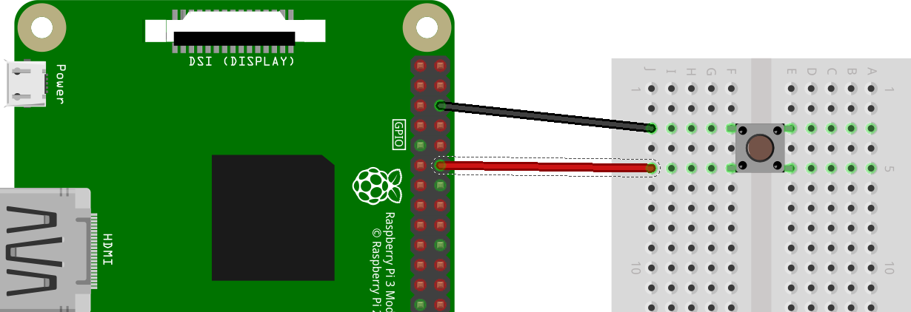

# Programar amb interrupcions

Hi ha varies maneres de llegir el valor de les entrades als pins GPIO per part del nostre programa. La primera i més senzilla de totes és la coneguda com a mètode de **sondeig** (polling). Aquest mètode consisteix en llegir, en un determinat instant, l'estat del pin. El mètode de sondeig es fa servir dintre de bucles i poden demanar molta càrrega al processador.

Una altra manera de llegir les entrades és a través de les anomenades **interrupcions** (*interrupts* o *edge detection* en anglès). Les interrupcions consisteixen en detectar un canvi d'estat de HIGH a LOW (*falling edge*) o de LOW a HIGH (*rising edge*). Aquest mètode és més eficient que el de sondeig ja què no és tan intensiu per al processador.

A la figura de sota tenim un polsador connectat al pin 12 de la Raspberry Pi. Si volem detectar si el polsador ha estat premut sense haver que estar constantment fent crides per a observar l'estat del pin (sondeig), el que podem fer es utilitzar la funció `add_event_detect` de la llibreria `RPi.GPIO`.





Acompanyarem aquesta connexió amb el codi Python següent, que podem anomenar `interrupts.py`. Aquest codi el que fa és comptar els segons que van passant i mostra a la pantalla el temps en segons. Però, quan el polsador és premut mostra el missatge "polsador premut":


```python
import RPi.GPIO as GPIO
import time

GPIO.setmode(GPIO.BOARD)

def my_callback(channel):
    print("polsador premut")
    
GPIO.setup(12, GPIO.IN, pull_up_down=GPIO.PUD_UP)
GPIO.add_event_detect(12, GPIO.FALLLING, calling=my_callback)

i = 0
while True:
    i = i + 1
    print(i)
    time.sleep(1)
```

Si executeu el codi amb privilegis de superusuari (`sudo`), alguna cosa semblant al que apareix a sota:
$ sudo python interrupts.py
1
2
3
polsador premut
4
polsador premut
5
polsador premut
polsador premut
6
Hem vist que només quan es detecta un cambi en l'estat del polsador s'executa la funció `my_callback` que porta només un argument (`channel`). Aquest argument especifica la entrada que va disparar la interrupció, permetent utilitzar la mateixa funció per a altres interrupcions.

La funció que s'executa quan es detecta la interrupció és:


```python
def my_callback(channel):
    print("polsador premut")
```

La línia de codi que fa la crida a la funció és:


```python
GPIO.add_event_detect(12, GPIO.FALLLING, calling=my_callback)
```

El primer paràmetre especifica el pin (12). El segon paràmetre pot ser `GPIO.FALLING`, `GPIO.RISING` o `GPIO.BOTH`. Si està en `FALLING`, la funció només serà cridada si el pin passa de `HIGH` a `LOW`. Aquest és el cas de l'exemple anterior. L'últim paràmetre correspon a la funció que ha de ser cridada quan es detecta aquesta interrupció.

D'aquesta manera s'obté un us més eficiant del processador.
