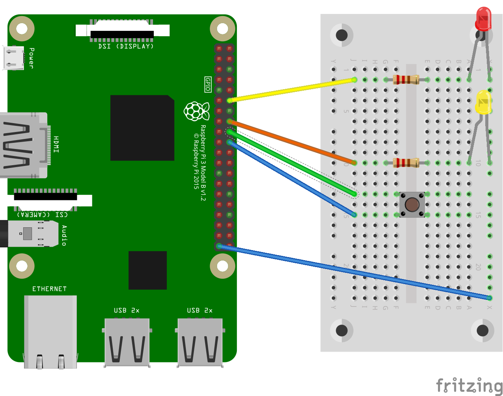

# Controlar les sortides GPIO a través d'internet

Veurem ara com controlar actuadors connectats als pins GPIO de la Raspberry Pi a través d'una interfície web. Per a fer això hem de tenir connectada la Raspberry Pi a internet a través de la xarxa wi-fi o ethernet (cable).

Crearem un servidro web que ens permeti controlar els pins GPIO a través de la xarxa. Per a fer-lo utilitzarem el mòdul `bottle` que ens permet crear la interfície web HTML.

Necessitarem el següent material:

* Protoboard i cables.
* Dos resistències de 220$\mathrm{k\Omega}$.
* Doss diodes LED.
* Un polsador

El muntatge el podem veure a la figura següent:




> **Nota:** Si necessiteu instal·lar la biblioteca `bottle` heu de posar al terminal d'ordres:

> `sudo apt install python-bottle`


El codi per fer funcionar el servidor web amb el qual controlar els LED i llegir l'estat del polsador és el següent:


```python
from bottle import route, run
import RPi.GPIO as GPIO

GPIO.setmode(GPIO.BOARD)
led_pins = [12, 16]
led_states = [0, 0]
switch_pin = 18

GPIO.setup(led_pins[0], GPIO.OUT)
GPIO.setup(led_pins[1], GPIO.OUT)
GPIO.setup(switch_pin, GPIO.IN, pull_up_down=GPIO.PUD_UP)

def switch_status():
    state = GPIO.input(switch_pin)
    if state:
        return "Sense polsar"
    else:
        return "Polsat"

def html_for_led(led):
    l = str(led)
    result = "input type='button' onClick='changed'()" + l + ")' value='LED " + l + "'/>"
    return result

def update_leds():
    for i, value in enumerate(led_states)
        GPIO.output(led_pins[i], value)
    
@route('/')
@route('/<led>')
def index(led):
    if led >= '0' and led <='1':
        led_num = int(led)
        led_states[led_num] = not led_states[led_num]
        update_leds()
    response = "<script>"
    response += "function changed(led)"
    response += "{"
    response += "    window.location.href='/' + led"
    response += "}"
    response += "</script>"
    
    response += '<h1>GPIO Control</h1>'
    response += '<h2>Button=' + switch_status() + '</h2>'
    response += '<h2>LEDs</h2>'
    response += html_for_led(0)
    response += html_for_led(1)
    return response

try:
    run(host='0.0.0.0', port=8080)
finally:
    print('\nCleaning up')
    GPIO.cleanup()
    
    
```

Per a executar el programa s'ha de fer com a superusuari:

`sudo python3 control_web.py`


