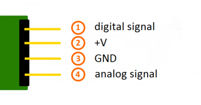

# Detecció de foc amb infraroigs

El mòdul KY-026 és un sensor d'infraroigs que es pot fer servir per a fer detecció de foc, ja que detecta flames de longituds d'ona que van de 760 nm a 1100 nm. 





Girant el cargol es pot ajustar la sensibilitat del sensor.


```python
import RPi.GPIO as GPIO
import time

FlamePin = 11

def init():
    GPIO.setmode(GPIO.BOARD)
    GPIO.setup(FlamePin, GPIO.IN, pull_up_down=GPIO.PUD_UP)

def myISR(ev=None):
    print "Flame is detected!"

def loop():
    GPIO.add_event_detect(FlamePin, GPIO.FALLING, callback=myISR)
    while True:
        pass

if __name__ == '__main__':
    init()
    try:
        loop()
    except KeyboardInterrupt: 
        print 'The end!'
```
