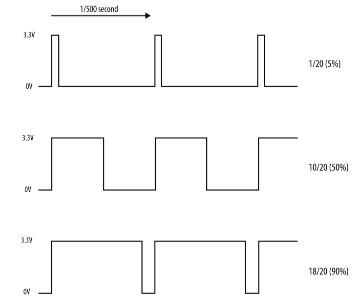

# Controlant la brillantor d'un LED

Per a controlar la brillantor d'un LED, la manera més comú de fer-lo es variant el valor del voltatge amb el que l'alimentem. El problema que tenim amb la Raspberry Pi és que només té sortides digitals, això vol dir que només pot proporcionar dos valors de voltatge (0 i 3,3V) que corresponen als estats `LOW` i `HIGH`. La solució a aquest problema consisteix en simular sortides analògiques utilitzant les sortides digitals amb un mètode anomenat **modulació d'amplada de pols (PWM)**.

## El mètode PWM (Pulse-Width Modulation)

El PWM és una tècnica molt enginyosa on, mitjançant el canvi de la longitud de polses elèctrics mentre es manté la quantitat de polses per segon (la freqüència en Hz) constant. A la figura de sota es pot veure com funciona el PWM.



En la primera gràfica es veu que la sortida digital està en estat `HIGH` només el 5% del temps, en el segon cas el 50% i en el tercer el 90%, això fa que l'efecte que tenim sobre el LED és un canvi de brillantor. El mateix mètode es pot fer servir per canviar la velocitat de gir d'un motor, per exemple. 


El codi que podem fer servir per controlar un LED connectat al pin 12 de la Raspberry Pi es:


```python
import RPi.GPIO as GPIO

led_pin = 12
GPIO.setmode(GPIO.BOARD)
GPIO.setup(led_pin, GPIO.OUT)

pwd_led = GPIO.PWM(led_pin, 500)
pwd_led.start(100)

while True:
    duty = int(input("Introdueix la brillantor (0 a 100): "))
    pwm_led.ChangeDutyCycle(duty)
    
```

En el codi anterior la funció `GPIO.PWM` aplica la tècnica al pin `led_pin` i amb una freqüència de 500 Hz (el període és de 1/500 s = 2 ms) i es crea l'objecte pwd_led amb aquesta configuració. Posteriorment s'arrenca el LED amb un valor inicial del cicle de treball (duty cycle) del 100%.

Posteriorment entrem a un bucle infinit on podem canviar el valor del cicle de treball (funció `ChangeDutyCycle`) i veure com canvia la brillantor del LED.
