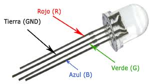

# Controlar un LED RGB

Els LED RGB són LED amb els quals podem controlar el color. El LED té 4 potes anomenades R (red), G (green), B (blue) i GND (terra). Podem controlar el color del led fent combinacions entre els tres colors. Si combinem vermell i blau ens sortirà un magenta, si barregem verd i blau ens sortirà un cian i barrenjant vermell i verd ens sortirà groc.

A la figura de sota podem veure un led RGB:



A la figura següent s'observa un LED RGB SMD (*surface mount device*):


Per a controlar la manera de barrejar els colors podem fer servir la tècnica PWM (veure controlar la [brillantor d'un LED](https://niobio.github.io/raspi/led/brillantor_led.html)).

Amb el codi següent podem cambiar el color i la intensitat de la llum d'un LED introduint la component de cada color amb un valor entre 0 i 100.


```python
import RPi.GPIO as GPIO

pins = {'pin_R':10, 'pin_G':11, 'pin_B':12}  # pins is a dict

GPIO.setmode(GPIO.BOARD)       # Numbers GPIOs by physical location
for i in pins:
    GPIO.setup(pins[i], GPIO.OUT)   # Set pins' mode is output
    GPIO.output(pins[i], GPIO.HIGH) # Set pins to high(+3.3V) to off led

p_R = GPIO.PWM(pins['pin_R'], 500)  # set Frequece to 500Hz
p_G = GPIO.PWM(pins['pin_G'], 500)
p_B = GPIO.PWM(pins['pin_B'], 500)

p_R.start(0)      # Initial duty Cycle = 0(leds off)
p_G.start(0)
p_B.start(0)

try:
    while True:
        duty_R = float(input("Enter red component (0 to 100): "))
        duty_G = float(input("Enter green component (0 to 100): "))
        duty_B = float(input("Enter blue component (0 to 100): "))
        p_R.ChangeDutyCycle(duty_R)
        p_G.ChangeDutyCycle(duty_G)
        p_B.ChangeDutyCycle(duty_B)

except KeyboardInterrupt:
    print("Ctrl + C, quit")
    p_R.stop()
    p_G.stop()
    p_B.stop()
finally:
    GPIO.cleanup()
```
