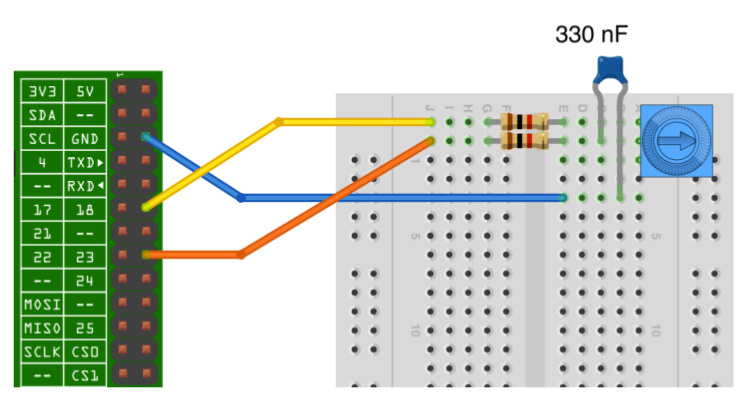
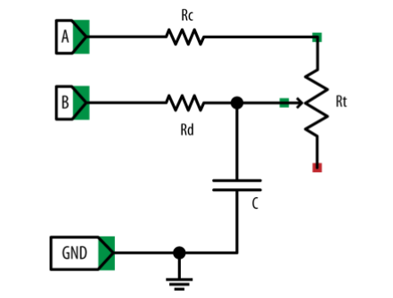

# Sensors analògics amb la Raspberry Pi

Els sensors són dispositius que obtenen informació dels seus voltants i la poden transmetre a la Raspberry per a que la pugui procesar i faci alguna acció a partir d'aquesta informació.

De sensors hi ha de dos tipus:

* **Digitals**: poden prendre dos estats possibles (encès/apagat, on/off, etc.). Exemples típics són els interruptors o els polsadors que es poden fer servir com sensors tàctils.

* **Analògics**: poden prendre més de dos valors. Són sensors analògics els sensors de temperatura, so, humitat, llum, etc. Generalment aquests sensors donen un voltatge o canvien el seu valor resistiu quan canvia la variable de l'entorn que mesuren, d'aquesta manera, amb un adequat calibratge, es pot mesurar aquesta variable. 

El problema que presenta la placa Raspberry Pi és que les seves entrades són digitals i no en té cap d'analògica, pel que hem de crear un conversor analògic-digital (A/D) per a poder mesurar una variable analògica a través d'una entrada digital.

Existeixen xips que fan aquesta conversió, però la manera més senzilla de fer-la és utilitzant un condensador. Els condensadors són dispositius electrònics que funcionen com acumuladors de càrrega i que poden tenir capacitats d'emmagatzematge diferents. La clau del funcionament del condensador com a conversor A/D radica en que el temps que tarda a carregar-se depèn de la intensitat de corrent que hi circula, per tant, si mesurem el temps que tarda a carregarse estarem mesurant la intesitat de corrent i així podem estimar els valor de la variable analògica.

## Connectar un sensor resistiu a la Raspberry amb un condensador

Utilitzarem una resistència variable (potenciòmetre) com a sensor. El potenciòmetre és una resistència per a la qual podem variar el seu valor girant un eix, tenim exemples d'aquest tipus de dispositius en els controls de volum d'alguns aparells amplificadots de so.

Per a fer la connexió necessitarem:

* Un protoboard i cables.
* Un potenciómetre de $10\,\mathrm{k\Omega}$.
* Dos resistències de $1\,\mathrm{k\Omega}$.
* Un condensador de 330 nF.

A la figura inferior podem observar el connexionat.



El circuit esquemàtic és el següent:



Les resistències Rc i Rd tenen la funció de protegir els pins de la Raspberry d'intensitats de corrents excesives en cas que la resistència del potenciòmetre Rt prengui el valor 0


El codi per al funcionament del sensor és el següent:


```python
import RPi.GPIO as GPIO
import time

GPIO.setmode(GPIO.BOARD)

# El pin a carrega el condensador a través d'una resistència fixa d'1k 
# i el potenciómetre en sèrie.
# El pin b descarrega el condensador a través de la resistència d'1k

pin_a = 12
pin_b = 16

# Funció per la descàrrega del condensador, deixant-lo buit per a començar la càrrega
def descarrega():
    GPIO.setup(pin_a, GPIO.IN)
    GPIO.setup(pin_b, GPIO.OUT)
    GPIO.output(pin_b, False)
    time.sleep(0.1)

# Funció que retorna el temps de càrrega del condensador en microsegons fins arribar
# al nivell HIGH, el qual és major o igual a 1.65V.
def temps_carrega():
    GPIO.setup(pin_b, GPIO.IN)
    GPIO.setup(pin_a, GPIO.OUT)
    GPIO.output(pin_a, True)
    t1 = time.time()
    while not GPIO.input(pin_b):
        pass
    t2 = time.time()
    return (t2 - t1) * 1000000

# Funció que pren el temps de càrrega del condensador com a lectura analògica
# després de primer descarregar el condensador
def lectura_analog():
    descarrega()
    t = temps_carrega()
    descarrega()
    return t

try:
    while True:
        print(lectura_analog())
        time.sleep(0.5)
finally:
    GPIO.cleanup()
```

El programa fa la lectura del temps de càrrega del condensador cada mig segon i l'imprimeix a la pantalla del terminal. Amb un adequat calibratge es pot transformar el temps en valors resistius, ja que la resistència és proporcional al temps de càrrega. Si en comptes d'un potenciòmetre haguèssim fet servir una LDR (resistència variable amb la llum) el temps de càrrega hauria estat inversament proporcional a la intensitat de llum. 
