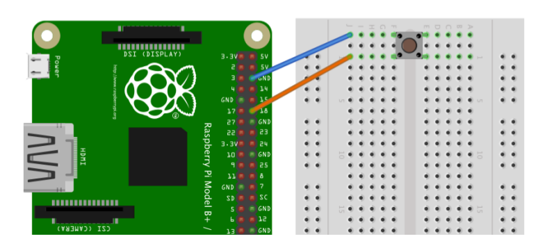

# Sensors digitals amb Raspberry Pi

Els sensors digitals son dispositius que admeten dos possibles estats com ser encès/apagat, sí/no, veritat/fals, etc.

El cas més típic és el d'un polsador o un interruptor que admet l'estat connectat o desconnectat. 

Veurem ara com gestionar amb la Raspberry Pi la informació donada per un sensor digital com un polsador. Conectarem el polsador a un pin de la Raspberry i per fer-ho provarem dues possibilitats, connectar-lo fent servir una resistència *pull up* o fent servir una resistència *pull down*. La forma de connexió es pot veure a la figura següent:


En la connexió *pull down* el pin de la Raspberry, quan el polsador està en repòs, té un voltatge null. El polsador té un terminal connectat a la font d'alimentació i l'altre connectat a la resistència que està connactada a terra (GND). Vout indica el punt de connexió al pin d'entrada de la Raspberry, si el polsador està obert Vout té un voltatge de 0 volts (estat 0) i quan el polsador està polsat, el voltatge Vout té el valor 5V (estat 1).

En la connexió *pull up* el pin de la Raspberry té un voltatge Vcc = 5V quan està el polsador està en repòs i passa a zero quan es prem el botó. Un valor típic de la resistència és d'$1\,\mathrm{k\Omega}$.

A vegades hi ha confusió amb el nom de *pull down* i *pull up*. Hem de pensar que el nom ve donat per l'estat en que es troba el pin en estat de repòs. D'aquesta manera, si tenim una resistència *pull down*, això vol dir que, en estat de repòs el voltatge del pin serà 0. El mateix raonamet podem fer per a la resistència *pull up*.

La necessitat de tenir una resistència es deu a la necessitat de tenir en estat de repòs un voltatge ben definit. Si el pin estigués lliure tindríem que el cable connectat a ell estaria fent d'antena i les ones de radio que hi ha al seu voltant estaría generant voltatges aleatoris i el pin passaria de LOW a HIGH de manera incontrolada i això no volem que passi.

## Codi en Python

Crearem un programa per a gestionar la informació donada pel sensor digital. Utilitzarem un polsador en connexió pull down i farem que el programa imprimeixi en la pantalla del terminal l'estat del polsador. 


```python
import RPi.GPIO as GPIO
import time

pols = 12

GPIO.setmode(GPIO.BOARD)
GPIO.setup(pols, GPIO.IN)    # pin 12 utilitzat com entrada del sensor

# bucle infinit
while 1:
    if GPIO.input(pols) == 1:
        print("Polsador premut")
    elif GPIO.input(pols) == 0:
        print("Polsador lliure")
    time.sleep(0.5)
```

El programa està sempre comprovant cada mig segon si el polsador ha estat premut i informa del seu estat. En aquest exemple hem fet que s'imprimeixi en la pantalla l'estat del polsador però també es pot fer que s'accionés un actuador, com ser encendre un motor o un altre dispositiu, depenent de l'estat del sensor, la qual cosa és l'ús més habitual dels sensors.

## Utilitzar els resistors pull-up i pull-down interns

En l'exemple anterior havíem utilitzat uns resistors per a fixar el voltatge de les entrades de la Raspberry en estat de repòs. En realitat això ho hem fet per entendre el concepte de resistència *pull up* i *pull down*, però ens ho podem estalviar perquè la Raspberry Pi ve amb resistències *pull up* i *pull down* internes i l'únic que hem de fer és activar-les.

Sense la resistència externa el nostre circuit quedarà com el de la figura següent:



L'activació de les resistències internes l'hem de fer quan declarem les entrades. En el nostre cas la línia de codi que hem de modificar quedaria:


```python
GPIO.setup(pols, GPIO.IN, pull_up_down=GPIO.PUD_DOWN )
```

Veiem com hem d'afegir-hi un paràmetre més, en aquest cas per activar la resistència interna com del tipus *pull down*.
