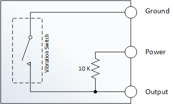

# Sensors de vibracions

A la figura podem veure un mòdul sensor de vibració KY-002.


Aquest sensor utilitza un interruptor de vibració Gaoxin SW-18010P i permet detectar impactes, cops i sacsejades o tremolades. Aquest interruptor consisteix en un terminal que forma una barra central i una molla que rodellal'eix central. Quan una força suficient es transfereix al interruptor i la molla es mou i els dos terminals s'ajunten temporalment. El posicionament de l'interruptor és important, es a dir, que l'interruptor ha d'estar tan a prop com sigui posible de l'àrea a monitoritzar. En cas contrari, la vibració detectada por ser amortiguada per altres components estructurals del projecte. En cas contrari, si l'interruptor resulta massa sensible per a la vostra aplicació proveu d'allunyar una mica el sensor de la zona a mesurar.


A la imatge de sota es pot apreciar l'esquema intern del mòdul KY-002.



Podem veure de l'esquema que quan es detecta una vibració, l'interruptor es tanca i el pin que estigui connectat a la sortida del mòdul, que estava detectant un valor `HIGH` passarà a estar en un estat `LOW` perquè passa a estar connectat a `GND`.

Farem un codi de prova que faci encendre un LED quan el sensor detecti una vibració. A continuació tenim el llistat del programa:


```python
import RPi.GPIO as GPIO

ShockPin = 11
LedPin   = 10

Led_status = 1

def setup():
    GPIO.setmode(GPIO.BOARD)       # Numbers GPIOs by physical location
    GPIO.setup(LedPin, GPIO.OUT)   # Set LedPin's mode is output
    GPIO.setup(ShockPin, GPIO.IN, pull_up_down=GPIO.PUD_UP)
    GPIO.output(LedPin, GPIO.HIGH) # Set LedPin high(+3.3V) to off led

def swLed(ev=None):
    global Led_status
    Led_status = not Led_status
    GPIO.output(LedPin, Led_status)  # switch led status(on-->off; off-->on)
        print("led: " + ("on" if Led_status else "off"))

def loop():
    GPIO.add_event_detect(ShockPin, GPIO.FALLING, callback=swLed, bouncetime=200) # wait for falling
    while True:
        pass   # Don't do anything

def destroy():
    GPIO.output(LedPin, GPIO.LOW)      # led off
    GPIO.cleanup()                     # Release resource

if __name__ == '__main__':     # Program start from here
    setup()
    try:
        loop()
    except KeyboardInterrupt:  # When 'Ctrl+C' is pressed, the child program destroy() will be  executed.
       destroy()
```
