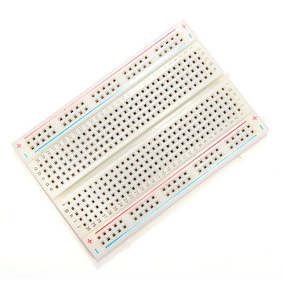
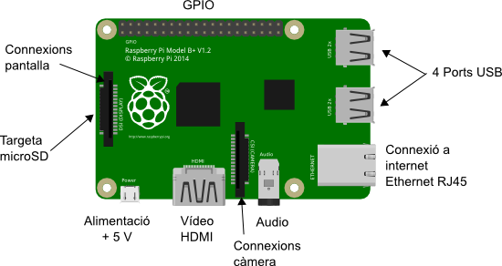
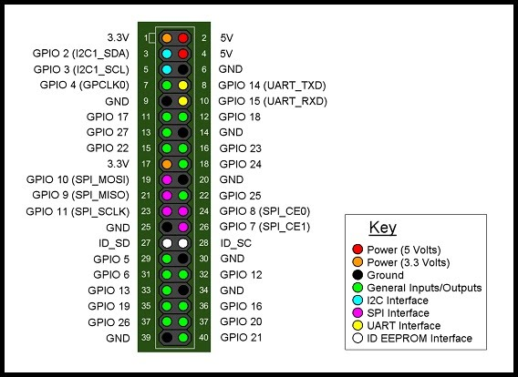
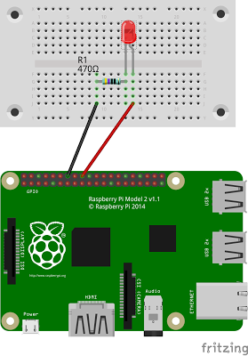

# Taller projecte Domus

## La placa de proves

La placa de proves o de prototipatge ràpid (també coneguda com *breadboard* o *protoboard* en anglès) ens permet crear circuits electrònics de manera ràpida sense necessitat de soldar els elements del circuit.



## La placa Raspberry Pi



## Els pins GPIO




## Encendre un LED




```python
from gpiozero import LED
from time import sleep

led = LED(24)

while True:
    led.on()
    sleep(1)
    led.off()
    sleep(1)
```

# Detecció de moviments amb infrarroigs


El sensor que es veu a la imatge inferior és un HC-SR501, es tracta d'un sensor infrarroig passiu (PIR), i serveix per a detectar moviments. Resulta habitual trobarlos als lavabos públics per encendre la llum quan detecta la presencia de persones.


Si vols saber més de com funcionen els PIR pots consultar <a href="https://learn.adafruit.com/pir-passive-infrared-proximity-motion-sensor/how-pirs-work" target="_blank">aquesta pàgina</a>.

A continuació tenim un exemple de codi que permet detectar el moviment:


```python
from gpiozero import MotionSensor, LED
from time import sleep

led = LED(24)
pir = MotionSensor(22)

while True:
    pir.wait_for_motion()
    print("Moviment detectat!")
    led.on()
    sleep(2)
    led.off()
```
