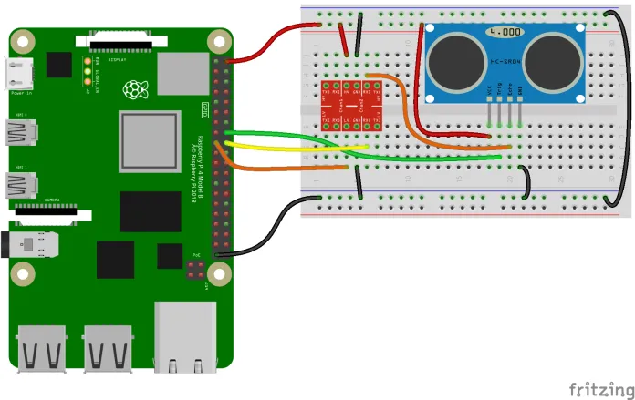

#Sensor d'ultrasons HC-SR04 amb Raspberry Pi
El sensor d'ultrasons HC-SR04 s'utilitza per determinar la distància a un obstacle o objecte. Utilitza un mètode semblant al que fan servir els ratpenats per detectar objectes. El sensor compta amb un emisor d'ultrasons i un receptor de l'eco. El càlcul de la distància es fa multiplicant la velocitat del so pel temps transcorregut entre l'instant d'enviament del senyal i l'instant de recepció i dividint-lo per 2, ja que el temps inclou l'interval d'anada i de tornada del senyal.

Distància = velocitat_so * temps_mesurat / 2

El sensor té 4 connectors:

* VCC: Alimentació (5V)
* GND: Connexió a terra
* TRIG: Pin per l'enviament del senyal ultrasònic
* ECHO: Pin on es rep el senyal ultrasònic

El sensor s'alimenta amb 5V, el pin TRIG funciona amb un nivell de 3.3V de la Raspberry Pi, però el pin ECHO no, ja que entrega un voltatge de 5V quan està en el seu nivell HIGH. Per aquest motiu farem servir un conversor de nivell lògic per a protegir la placa Raspberry Pi de sobretensions.

## Esquema de connexió dels components

<div>

</div>

## Codi Python

El codi que presentem a continuació permet obtenir la distància i imprimir-la en consola cada mig segon.

```python
import RPi.GPIO as GPIO
import time

TRIG = 16 #Variable que conté el GPIO del TRIG
ECHO = 18 #Variable que conté el GPIO al cual conectamos la señal ECHO del sensor

GPIO.setmode(GPIO.BOARD)     #Establecemos el modo según el cual nos refiriremos a los GPIO de nuestra RPi            
GPIO.setup(TRIG, GPIO.OUT) #Configuramos el pin TRIG como una salida 
GPIO.setup(ECHO, GPIO.IN)  #Configuramos el pin ECHO como una salida 


#Contenemos el código principal en un aestructura try para limpiar los GPIO al terminar o presentarse un error
try:
    #Creem un loop infinit
    while True:

        # Inicialitzem el TRIG
        GPIO.output(TRIG, GPIO.LOW)
        time.sleep(0.5)

        #Engeguem el TRIG i esperem 10 uS abans d'apagar-lo
        GPIO.output(TRIG, GPIO.HIGH)
        time.sleep(0.00001)
        GPIO.output(TRIG, GPIO.LOW)

        # En aquest instant el sensor envia 8 pulsos ultrasònics de 40kHz i posa el pin ECHO en HIGH
        # Hem de capturar aquest instant
        
        while True:
            pulso_inicio = time.time()
            if GPIO.input(ECHO) == GPIO.HIGH:
                break

        # El pin ECHO es mantindrà en HIGH fins rebre l'eco rebotat pel obstacle.
        # En aquell moment el sensor posarà el pin ECHO en LOW.
	    # Capturarem aquest instant per poder determinar l'interval de medició
        
        while True:
            pulso_fin = time.time()
            if GPIO.input(ECHO) == GPIO.LOW:
                break

        # Temps mesurat en segons
        duracion = pulso_fin - pulso_inicio

        #Obtenim la distància tenint en compte que el senyal recórre la distància d'anada i tornada i que la velocitat del so és de 343m/s
        
        distancia = (34300 * duracion) / 2

        # Imprimim el resultat
        print( "Distancia: %.2f cm" % distancia)

finally:
    # Reiniciem tots els canals de GPIO.
    GPIO.cleanup()
```